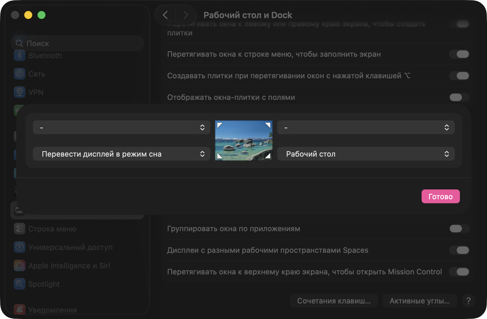
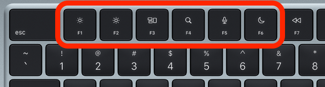

# `⚙️` НАСТРОЙКИ

## `📐` Активные углы
Наведение мышью на активные углы - очень удобно блокировать экран одним свайпом и расчищать рабочий стол.
> `Настройки` $\to$ `Рабочий стол и Dock` $\to$ `Активные углы` $\to$ Настроить как на картинке:
> 
> 

## `🗃️` Строка пути в Finder
По умолчанию Finder не показывает полный путь к открытой папке. Но есть возможность отобразить интерактивный путь внизу окна.
> - или `Верхнее меню Finder` $\to$ `Вид` $\to$ `Показать строку пути`
> - или <kbd>⌥</kbd>+<kbd>⌘</kbd>+<kbd>P</kbd> из любого окна Finder

## `🔍` Быстрый зум
Зум экрана на зажатие <kbd>ctrl</kbd> - незаменимая функция, когда нужно быстро что-то приблизить.
> `Настройки` $\to$ `Универсальный доступ` $\to$ `Увеличение` $\to$ `Клавиша модификации` $\to$ `ctrl`

## `🩻` Тень на скриншотах
По умолчанию все скриншоты сохраняются с тенью, которая не везде красиво отображается. Можно выключить тень при создании скриншотов.
> В терминале:
> ```bash
> defaults write com.apple.screencapture disable-shadow -bool true
> killall SystemUIServer
> ```

## `📁` Скрытые файлы
Иногда нужен наглядный доступ к скрытым файлам из Finder, но по умолчанию их отображение выключено. Можно включить, чтобы скрытые файлы отображались всегда.
> В терминале:
> ```bash
> defaults write com.apple.finder AppleShowAllFiles -bool true
> killall Finder
> ```

## `⌨️` Переназначение функциональных клавиш
Мне удобно менять язык на <kbd>CapsLock</kbd>, потому что эта кнопка почти никогда не используется по прямому назначению, но располагается при этом очень удобно. Есть стандартный способ сделать переключение языка на <kbd>CapsLock</kbd> в настройках, но он работает криво, потому что <kbd>CapsLock</kbd> сам по себе сделан так, чтобы при быстром нажатии он не срабатывал. И если надо быстро переключить язык, кнопка часто не срабатывает.

Поэтому я переназначил капс на F1, а чтобы не потерять функциональность капса, я назначил его на кнопку с микрофоном, которой я никогда не пользуюсь:
- `CapsLock` $\to$ `F1`
- `кнопка с микрофоном (F5)` $\to$ `CapsLock` 

А потом в настройках поставил смену языка на <kbd>F1</kbd>. Капс работает как и обычно, но по нажатию на кнопку с микрофоном.
> 1. Для переназначения кнопок нужен .plist файл. Его можно создать [генератором](https://hidutil-generator.netlify.app/), там интерфейс очень простой. Но у него нет специальных клавиш, таких как кнопка с микрофоном:
>
>    
>
>    Поэтому пока нужно вместо нее поставить любую другую клавишу.
> 2. В сгенерированном файле нужно вручную заменить код клавиши на специальную (например, кнопку dictation, как у меня). Коды специальных клавиш указаны [здесь](files/special_keys.txt).
> 3. Полученный файл нужно закинуть в папку `~/Library/LaunchAgents`. [Пример моего файла](files/com.local.KeyRemapping.plist).
> 4. Перейти в `Настройки` $\to$ `Клавиатура` $\to$ `Сочетания клавиш` $\to$ `Источники ввода`.
> 5. Выбрать предыдущий источник ввода - `F1`, выбрать следующий источник в меню ввода - отключить галочку.
> 6. Перезагрузить комп.

## `🏝️` Скрыть островок камеры
todo

## `🖥️` Настройка zsh
todo

# `👨‍💻` ПРОГРАММЫ

## `Raycast` для упрощения жизни
todo

## `Mos` для плавной прокрутки мыши
todo

## `HammerSpoon` для некоторых автоматизаций
todo

## `Hidden Bar` для управления значками в верхнем меню
todo

## `MarkEdit` для markdown-файлов
todo

## `BetterDisplay` для настройки мониторов
todo

## `Stats` для отслеживания статистики
todo
