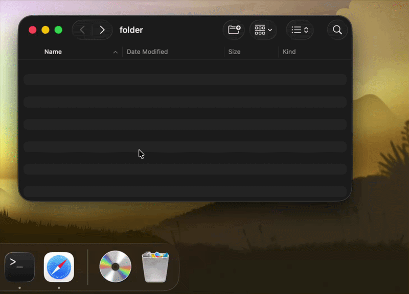
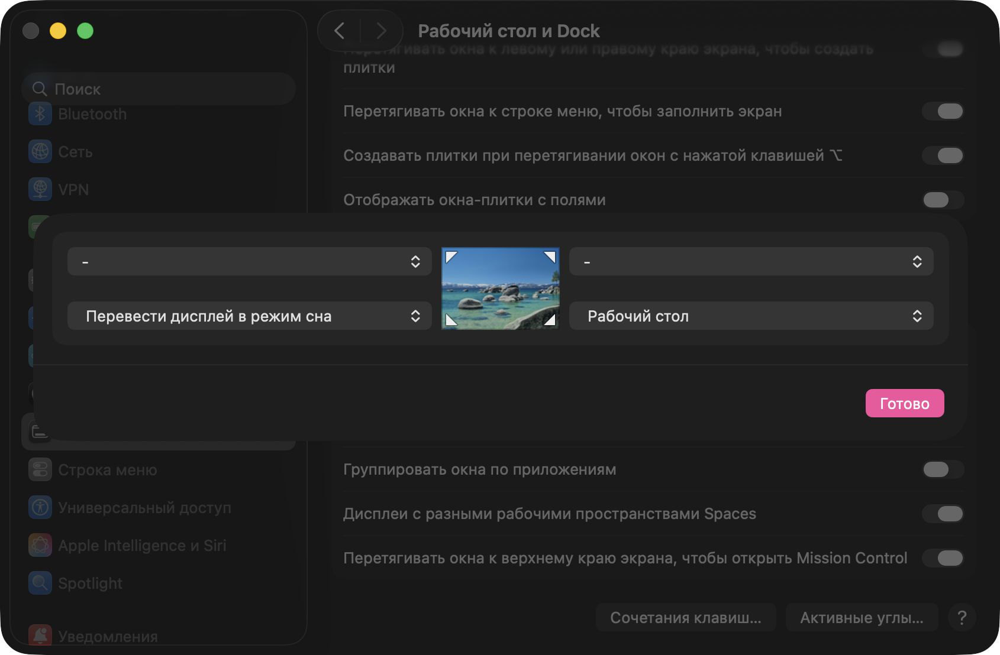
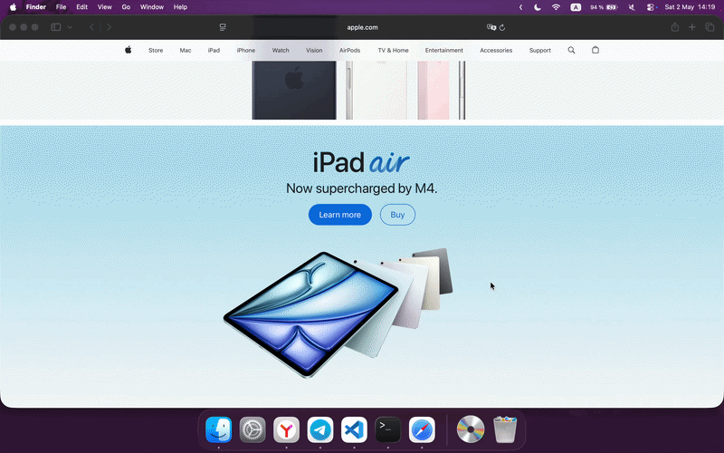
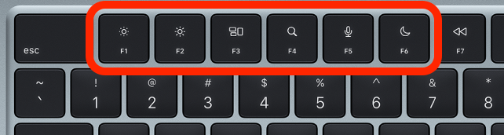
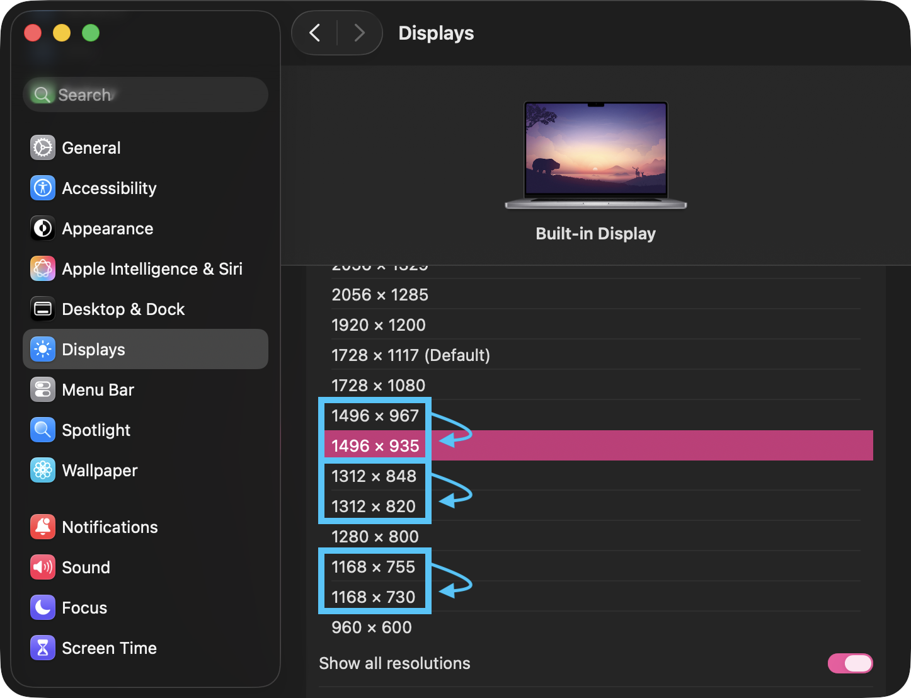
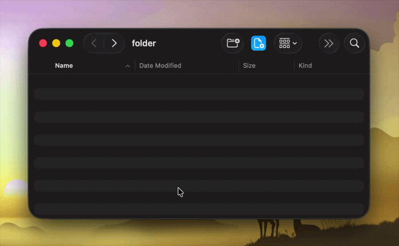

# `⚙️` НАСТРОЙКИ

Здесь я написал всякие полезные и удобные настройки для MacOS, которые у меня накопились за годы пользования.

## Содержание
- `📐` [Упрощение навигации активными углами](#-активные-углы)
- `🗃️` [Отображение пути в Finder](#️-строка-пути-в-finder)
- `🔍` [Быстрый зум в любом месте](#-быстрый-зум)
- `🩻` [Отключение тени на скриншотах](#-тень-на-скриншотах)
- `📁` [Отображение скрытых файлов](#-скрытые-файлы)
- `⌨️` [Переназначение особых клавиш](#️-переназначение-функциональных-клавиш)
- `🏝️` [Скрыть островок камеры](#️-скрыть-островок-камеры)
- `📄` [Создать новый файл в Finder](#-создать-новый-файл-в-finder)

---

## `📐` Активные углы

<div align="right">

[<code> ← в содержание </code>](#содержание)

</div>



Наведение мышью на активные углы - очень удобно блокировать экран одним свайпом и расчищать рабочий стол. Когда мне надо куда-то отойти, я просто делаю жест на трекпаде и быстро блокирую экран.

<details>
<summary>&nbsp;<b>Как настроить ✨</b></summary>
<blockquote></blockquote>
<blockquote>

`Настройки` $\to$ `Рабочий стол и Dock` $\to$ `Активные углы` $\to$ Настроить как на картинке:


</details>
</blockquote>
</details>

## `🗃️` Строка пути в Finder

<div align="right">

[<code> ← в содержание </code>](#содержание)

</div>


По умолчанию Finder не показывает полный путь к открытой папке. Но есть возможность отобразить интерактивный путь внизу окна.

<details>
<summary>&nbsp;<b>Как настроить ✨</b></summary>
<blockquote></blockquote>
<blockquote>

- или `Верхнее меню Finder` $\to$ `Вид` $\to$ `Показать строку пути`
- или <kbd>⌥</kbd>+<kbd>⌘</kbd>+<kbd>P</kbd> из любого окна Finder
</details>
</blockquote>
</details>

## `🔍` Быстрый зум

<div align="right">

[<code> ← в содержание </code>](#содержание)

</div>



Зум экрана скроллом на зажатие <kbd>ctrl</kbd> - незаменимая функция, когда нужно быстро что-то приблизить.

<details>
<summary>&nbsp;<b>Как настроить ✨</b></summary>
<blockquote></blockquote>
<blockquote>

`Настройки` $\to$ `Универсальный доступ` $\to$ `Увеличение` $\to$ `Клавиша модификации` $\to$ `ctrl`
</details>
</blockquote>
</details>

## `🩻` Тень на скриншотах

<div align="right">

[<code> ← в содержание </code>](#содержание)

</div>

По умолчанию все скриншоты сохраняются с тенью, которая не везде красиво отображается. Например, через <kbd>⌘</kbd>+<kbd>Shift</kbd>+<kbd>4</kbd>, потом <kbd>Space</kbd>. Можно выключить тень при создании скриншотов.

<details>
<summary>&nbsp;<b>Как настроить ✨</b></summary>
<blockquote></blockquote>
<blockquote>

В терминале:
```bash
defaults write com.apple.screencapture disable-shadow -bool true
killall SystemUIServer
```
ℹ️ *чтобы вернуть обратно, надо заменить `true` на `false` в команде*
</details>
</blockquote>
</details>

## `📁` Скрытые файлы

<div align="right">

[<code> ← в содержание </code>](#содержание)

</div>

Иногда нужен наглядный доступ к скрытым файлам из Finder, но по умолчанию их отображение выключено. Можно сделать так, чтобы скрытые файлы отображались всегда.

<details>
<summary>&nbsp;<b>Как настроить ✨</b></summary>
<blockquote></blockquote>
<blockquote>

В терминале:
```bash
defaults write com.apple.finder AppleShowAllFiles -bool true
killall Finder
```
ℹ️ *чтобы вернуть обратно, надо заменить `true` на `false` в команде*
</details>
</blockquote>
</details>

## `⌨️` Переназначение функциональных клавиш

<div align="right">

[<code> ← в содержание </code>](#содержание)

</div>

Мне удобно менять язык на <kbd>CapsLock</kbd>, потому что эта кнопка почти никогда не используется по прямому назначению, но располагается при этом очень удобно. Есть стандартный способ сделать переключение языка на <kbd>CapsLock</kbd> в настройках, но он работает криво, потому что <kbd>CapsLock</kbd> сам по себе сделан так, чтобы при быстром нажатии он не срабатывал. И если надо быстро переключить язык, кнопка часто не срабатывает.

Поэтому я переназначил капс на F1, а чтобы не потерять функциональность капса, я назначил его на кнопку с микрофоном, которой я никогда не пользуюсь:
- `CapsLock` $\to$ `F1`
- `кнопка с микрофоном (F5)` $\to$ `CapsLock`

А потом в настройках поставил смену языка на <kbd>F1</kbd>. Капс работает как и обычно, но по нажатию на кнопку с микрофоном.

<details>
<summary>&nbsp;<b>Как настроить ✨</b></summary>
<blockquote></blockquote>
<blockquote>

1. Для переназначения кнопок нужен .plist файл. Его можно создать [генератором](https://hidutil-generator.netlify.app/), там интерфейс очень простой. Но у него нет специальных клавиш, таких как кнопка с микрофоном:

   

   Поэтому пока нужно вместо нее поставить любую другую клавишу.
2. В сгенерированном файле нужно вручную заменить код клавиши на специальную (например, кнопку dictation, как у меня). Коды специальных клавиш указаны [здесь](files/special_keys.txt).
3. Полученный файл нужно закинуть в папку `~/Library/LaunchAgents`. [Пример моего файла](files/com.local.KeyRemapping.plist).
4. Перейти в `Настройки` $\to$ `Клавиатура` $\to$ `Сочетания клавиш` $\to$ `Источники ввода`.
5. Выбрать предыдущий источник ввода - `F1`, выбрать следующий источник в меню ввода - отключить галочку.
6. Перезагрузить комп.
</details>
</blockquote>
</details>


## `🏝️` Скрыть островок камеры

<div align="right">

[<code> ← в содержание </code>](#содержание)

</div>

Сам по себе островок для камеры меня не напрягает. Но из-за его наличия значки и кнопки в верхнем меню вынуждены прятаться. И это очень сильно сбивает с толку, если нужно быстро по памяти перейти в какое-то меню или открыть что-то из значка.

Есть способ спрятать этот островок, уменьшив активную область экрана, чтобы вся верхняя полоская всегда была выключена.

<details>
<summary>&nbsp;<b>Как настроить ✨</b></summary>
<blockquote></blockquote>
<blockquote>

1. `Настройки` $\to$ `Дисплеи` $\to$ `Показать все разрешения`
2. Нужно сменить текущее разрешение экрана на такое же, но с меньшим числом по вертикали:

   
   
   *(default не выделен на картинке случайно)*
</details>
</blockquote>
</details>

## `📄` Создать новый файл в Finder

<div align="right">

[<code> ← в содержание </code>](#содержание)

</div>



В Finder нет кнопки для быстрого создания пустого файла, а иногда очень нужно быстро создать какой-нибудь `.txt`. Для этого можно встроенными средствами создать простейшее приложение, которое при запуске создает пустой файл в активном окне Finder. И добавить иконку этого приложения как кнопку прямо в верхнюю часть окна рядом с кнопкой для создания папки. Готовое приложение есть в [файлах](files/create_new_file.app). Или можно легко создать собственное:

<details>
<summary>&nbsp;<b>Как настроить ✨</b></summary>
<blockquote></blockquote>
<blockquote>

1. Открыть встроенное приложение `Automator`.
2. При запуске появится окно с выбором типа проекта, нужо выбрать Приложение (Application).
3. Найти в поиске `Run AppleScript` и вписать туда такой код:
   ```AppleScript
   tell application "Finder" to make new file at (the target of the front window) as alias with properties {name:"file"}
   ```
   *вместо "file" можно написать любое имя, в том числе и с `.txt`, чтобы по умолчанию создавался сразу текстовый файл*

4. Нажать <kbd>⌘</kbd>+<kbd>s</kbd>, выбрать место установки (*любое*) и название (*любое*). Например, я назвал `create_new_file.app` и сохранил в свою личную папку.
5. Для красоты нужно сменить иконку. Ее можно найти и скачать с [macosicons.com](https://macosicons.com) (или самому нарисовать). Крайне желательно в формате `.icns`. Например, я выбрал вот такую:
   
   
   
   С новым Liquid Glass у вас нет шансов сделать вписывающуюся в дизайн кнопку, поэтому мой выбор еще не так уж плох. Я оставил эту иконку в [файлах](files/new_file_icon.icns).
6. Сначала нужно скопировать выбранную иконку (<kbd>⌘</kbd>+<kbd>c</kbd> по файлу иконки). Затем надо нажать правой кнопкой по нашему `.app`-приложению и открыть его свойства. В левом верхем углу нажать на иконку, потом <kbd>⌘</kbd>+<kbd>v</kbd>. 
7. Затем нужно с зажатым <kbd>⌘</kbd> перенести это `.app`-приложение в верхнюю панель Finder. Готово.
</details>
</blockquote>
</details>
